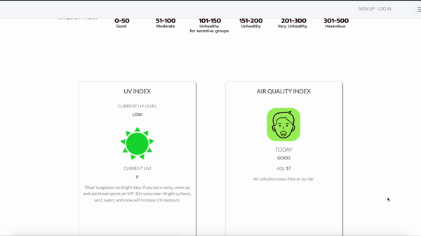

## Project Proposal

### Background Stroy
I think we can all agree that 2020 has been emotionally exhausting for everyone. For me and my family, it was a rough sheltering inside the house, not only from Covid19 but also from the California wildfires. Not being able to open the windows and the thought of not knowing if it was safe to go outside became the daily norm. From this experience alone, it inspired me to create an application called Flag Red. Flag Red is an application that shows real-time air qualities, active wildfires and soil conditions on the map.

### Why do we need Flag Red?

- We want to be your safeguard from air pollution.
Polluted air affects well-being with disruption to our ecosystem and various health risks. Flag Red helps identify pollution-dense in your location and monitor air pollution. Poor air quality levels can aggravate respiratory ailments, wheezing, lowers immunity, fatigue and much more. Air Pollution is also an indicator of global warming and climate change.

- Protect yourself from wildfires today.
Active fires not only disrupts an ecosystem with severe injuries, loos of life, and damage to property. Fires also affects life in various forms with toxic amounts of lingering pollution in the air. This is harmful to Human and Earth.

- Make better decisions with the real-time soil data
Farmers and horticulturalists rely on soil condition and weather to estimate crop growth through guesswork and experience with possible errors. Soil moisture and temperature dictate the type of biome present and the land suitability for growing crops.

### Overview

Flag Red is a web app displays air quality information, active fires, soil condition around the location users type in as well as  global scope of air qualities.  A user types in the city/zip code to check the air quality, active fire, soil condition and the map will display a red flag marker that shows detailed information that user's looking for. Depending on the location the user types in, the widgets below the map show the air quality index and UV index, six days of air quality forecast  in  that location. On the profile page, users can switch on to get SMS service for air quality alerts and also can see the air quality index and UV index, six days of air quality forecast around the user's location without searching on the main page.

### Technologies required 

Fire data API from ambee. Air quality API from ambee.

Python, Javascript, HTML5, CSS3, Flask, React, Bootstrap, SQL, PostgreSQL

### Data

Ambee fire/air quality API, WAQI API, Google Maps API.

### Roadmap

#### MVP

- Users can type a city or zip code to Seach the air quality/active fire/soil condition around the location.
- Map shows the air quality markers with colors based on the air quality index.
- Map shows active fire markers with the detailed information about the fire detection.
- Map shows a marker that contains soil condition.
- Users can switch on to get air quality alerts on Profile.
- Users can see current UV index, current air quality, air quality forecast based on the user's location.

#### 2.0

- Users can log-in with Facebook, google, twitter
- Add wild fire alert.

#### 3.0

- Users can share the fire alert/current wildfire on Socail Media though Flag Red homepage.
- Users can wee the statistic analization graph of air quality around the User's location.

### Notes